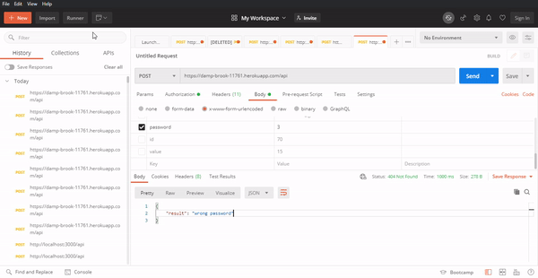

# assignment-anaskhan

## Thank you for the opportunity!

### This is the heroku live server URL -> https://damp-brook-11761.herokuapp.com/ 

## Important Note-> 

1. **Run Your Postman and Enter the url** https://damp-brook-11761.herokuapp.com/api 

2. **In the Body field, enter key to password and value to 1 to achieve the success result and send a request**

3. **In case of wrong password sent , wrong password will show up** .

## Demo

## Thank you!!
